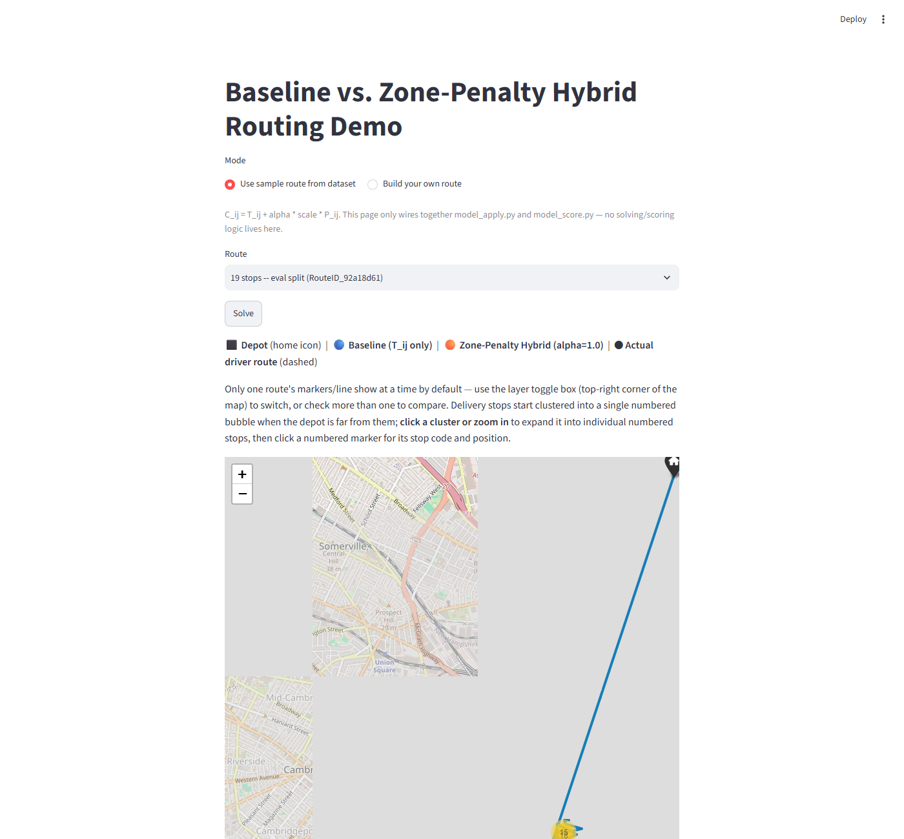
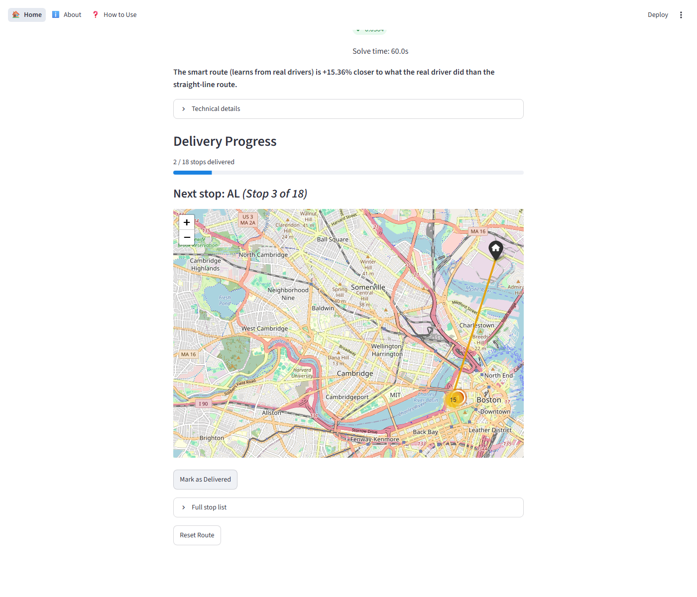
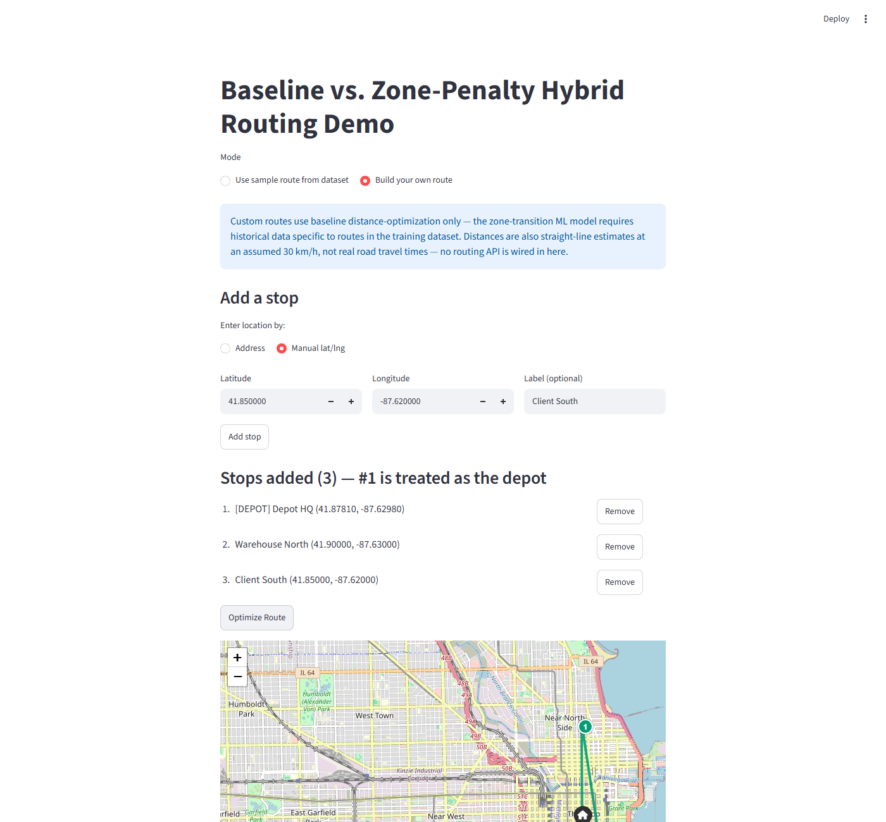

# Data-Driven Last-Mile Routing

A hybrid machine-learning + optimization system that plans delivery routes the way real drivers actually drive — not just the shortest path on paper.

---

## The Problem

Delivery drivers often take a different route than the "shortest path" a computer would calculate — because real streets, parking, and shortcuts matter more than straight-line distance. This project learns from thousands of real Amazon drivers' historical routes and builds a system that suggests delivery orders closer to how real drivers actually work, not just the mathematically shortest path.

## Screenshots



*Side-by-side comparison view: the map overlays the straight-line baseline route, the zone-penalty hybrid route, and the real driver's actual path — toggle each layer on or off.*


*After solving a route, "Mark as Delivered" walks through the stop order one at a time; delivered stops drop off the map and the next stop is highlighted.*


*Enter your own depot and stop locations (by address or lat/lng) and get an optimized visiting order for a route that isn't in the dataset at all.*

## The Result

On a random sample of 15 real delivery routes, this approach matched real drivers' actual choices 31.7% more closely than a pure shortest-distance approach.

(Full methodology and numbers below in [Known Limitations](#known-limitations) and in `docs/project_brief.md`.)

## How It Works

In plain terms, three steps:

1. **Clean the raw data.** Amazon's dataset ships as large, messy, nested JSON files. A pipeline joins them into tidy tables — one route, one stop, one package per row.
2. **Learn how drivers actually move between neighborhoods.** By looking at thousands of historical routes, the system learns which "zone-to-zone" transitions real drivers make often, and which ones they almost never make (even if it's geographically the shortest hop).
3. **Feed that into a route-solving engine.** A route optimizer (Google's OR-Tools) then plans the visiting order for a new route, but instead of only minimizing straight-line travel time, it also penalizes hops between zones that real drivers rarely take — pulling the suggested route closer to real driving behavior.

### Technical Details

<details>
<summary>Architecture, cost function, and stack (click to expand)</summary>

**Pipeline:** `data_pipeline.py` (raw JSON → Parquet) → `zone_penalty.py` (empirical zone-transition penalty table, built from every training route's actual stop sequence) → `model_apply.py` (Asymmetric TSP solve via OR-Tools) → `model_score.py` (official Amazon Last-Mile Challenge scoring metric).

An XGBoost "per-stop difficulty" model (`model_build.py`) was also built and is kept in the repo as a documented, unused exploration — see [Known Limitations](#known-limitations) for why it didn't make it into the live cost function.

**Hybrid cost function**, used as the arc cost inside the ATSP solve:

```
C_ij = T_ij + α · scale · P_ij
```

- `T_ij` — real pairwise travel time between stop *i* and stop *j*, from the dataset's precomputed travel-time matrix.
- `P_ij = 1 − P(zone(j) | zone(i))` — the empirical zone-transition penalty: 1 minus the observed probability that a driver moves from stop *i*'s zone into stop *j*'s zone, computed across every training route's actual sequence.
- `α` — tunable weight (default `1.0`) balancing raw travel time against learned driver habit.
- `scale` — each route's own mean `T_ij`, so the penalty term is on a comparable scale to travel time regardless of route size.

The solver's hard constraints (service time, time windows) stay on the real `T_ij` + `service_time` — only the arc-cost objective that OR-Tools optimizes over is modified.

**Stack:** pandas / pyarrow / Dask / ijson (pipeline), Google OR-Tools (ATSP solver — `PARALLEL_CHEAPEST_INSERTION` first-solution strategy, `GUIDED_LOCAL_SEARCH` metaheuristic), XGBoost + scikit-learn (unused exploration), Streamlit + streamlit-folium + folium + geopy (dashboard).

</details>

## Try It Yourself

### Run the interactive dashboard

```bash
pip install -r requirements.txt
streamlit run src/app.py
```

This opens a multi-page Streamlit app: a Home page with the baseline-vs-hybrid comparison demo (pick a sample route or build your own), an About page, and a How to Use page.

### Run the raw pipeline from the command line

```bash
# 1. Convert raw JSON into cleaned Parquet tables (data/raw -> data/processed)
python src/data_pipeline.py --split all

# 2. Train the (currently unused / exploratory) difficulty model
python src/model_build.py

# 3. Solve a route with OR-Tools (omit --route-id to auto-pick a default test route)
python src/model_apply.py --route-id <RouteID_...> --alpha 1.0

# 4. Score a solved route's sequence against the official metric
python src/model_score.py --route-id <RouteID_...>

# Reproduce the 15-route baseline-vs-hybrid comparison
python src/compare_baseline_vs_hybrid.py --n-routes 15
```

Each script also accepts `--help` for its full flag list (processed-data directory, time budget, seed, etc.).

## Dataset

This project runs on the **2021 Amazon Last-Mile Routing Research Challenge dataset** (co-organized with the MIT Center for Transportation & Logistics), hosted on the AWS Open Data Registry. It contains **9,164 real historical delivery routes** (6,112 training / 3,052 evaluation) executed by actual Amazon drivers across 5 U.S. metropolitan areas, including package-level details, time windows, a precomputed pairwise travel-time matrix per route, and the ground-truth stop order each driver actually followed.

```bash
aws s3 sync --no-sign-request s3://amazon-last-mile-challenges/almrrc2021/ ./data/
```

## Known Limitations

- **Solver feasibility is ~90%, not 100%,** at a 15-second solve budget — in a 30-route random sample, 3/30 routes came back infeasible almost instantly under the `PARALLEL_CHEAPEST_INSERTION` strategy. Not yet root-caused. (At the 60-second budget used for the headline comparison, feasibility was 15/15.)
- **An XGBoost per-stop "difficulty score" model was tried and dropped.** It never reached a usable validation R² (best result: -0.0424, still negative after a feature-leakage fix), so per an explicit stop condition it was not wired into the live cost function. It's kept in the repo (`model_build.py`, `models/`) as documented, unused exploration; a lightweight zone-transition-frequency penalty (`zone_penalty.py`) is used instead.
- **Results are time-budget sensitive.** The same route can score meaningfully differently depending on how long OR-Tools is allowed to search (e.g. 0.1749 at 60s vs. 0.2287 at 20s on one test route) — this is expected behavior for the `GUIDED_LOCAL_SEARCH` metaheuristic under a fixed wall-clock limit, not a bug. All comparison numbers in this README used a consistent 60-second budget per solve.
- **Custom/manual routes (the "build your own route" mode) only get baseline treatment.** The zone-transition penalty model requires historical data tied to specific dataset zones, so routes built from arbitrary addresses are optimized on straight-line-estimated travel time alone, with no zone penalty applied.

## Attribution

The scoring logic in `src/model_score.py` is a verified, line-for-line port of the official challenge scoring script from [MIT-CAVE/rc-cli](https://github.com/MIT-CAVE/rc-cli/blob/main/scoring/score.py) (MIT License, Copyright © MIT Center for Transportation & Logistics). Full attribution and license text are included in that file's module docstring.

## Author

[Your name here] — [links here]
#
